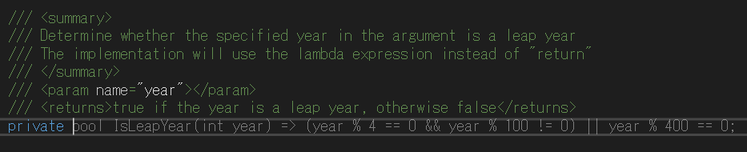

# 2. GitHub Copilot

## GitHub Copilot の使い方

### コードの提案

前の章で作成した `Controllers/HelloController.cs` ファイルを開きます。  
ファイル内を編集する状態で改行入力やメソッドシグネチャ入力を行うと、 GitHub Copilot がコードの提案を開始します。


コードの提案を明示的にトリガーすることもできます。  
ショートカットキー `Ctrl + Alt + \` を入力することで、コードの提案が表示されます。（もし `Ctrl + Alt + \` で提案が表示されない場合は、文字入力または改行入力を行って数秒待つことで提案が表示されるかどうかを確認してください。）

コードの候補が表示されたら、 `Tab` キーを押して確定します。

### 代案の表示

GitHub Copilot が提案したソースコードの内容が、期待したものと一致しない場合があります。  
このような場合において、最初に提案されたコードの代案を提示させることもできます。  
ショートカットキーは、次の案を表示する場合は `Alt + .` を、前の案を表示する場合は `Alt + ,` を使用します。

例えば、 GitHub Copilot から最初に↓のような提案がされたとします。


`Alt + .` を押下すると、上記とは異なるコードが出力されます。


### 代替候補リストの表示

`Ctrl + Alt + Enter` を押すと、最大 10 個の代替候補が表示されます。


## ドキュメント・設定ファイルに対する GitHub Copilot の活用

### Markdown ドキュメントの作成

GitHub Copilot は Markdown ドキュメントの作成にも役立ちます。  
動作を確認するため、 README.md ファイルを新規作成してください。  
例えば、 `#` を入力すると、ドキュメントのコンテキストに基づいて予想されたものが提案として表示されます。


### 設定ファイルの編集

.NET の構成プロファイルの一つである appsettings.json の編集時にも GitHub Copilot を使うことができます。  
例えば、環境変数の追加する際などに活用できます。


## .NET ソースコード実装における GitHub Copilot の活用

### サンプルデータの作成

ソースコード実装を行う際に、サインプルデータを作成してローカルでテストする場面があるかと思います。  
そのような場面で、 GitHub Copilot を活用してサンプルデータを簡単に作成することができます。  
例えば、アメリカ人男性の名前のサンプルデータを作成したい場合、下記のようなコメントを使用することで GitHub Copilot はアメリカ人男性の名前のサンプルリストを生成できます。

```csharp
// Create 5 sample data of American men's names in List<string>
```

GitHub Copilot により生成されたアメリカ人男性の名前リストは下記のようになります。


### バリデーション処理やユーティリティメソッドの実装

.NET でバリデーション処理やユーティリティメソッドを実装する場面は多々あるかと思います。  
そういった場面でも、コメントを記述することで GitHub Copilot がコード提案を行ってくれます。

#### メールアドレス形式のバリデーション

例えば、メールアドレスの形式が正しいかどうかを判断するメソッドを実装する場合は、下記のようにコメントを記述します。

```csharp
/// <summary>
/// Determine whether the string specified as an argument is in the format of a valid email address using regex
/// </summary>
/// <param name="email"></param>
/// <returns>true if the email address is valid, otherwise false</returns>
```

実際に出力されるコードは次のようになります。


上記結果では、正規表現 `^([\w\.\-]+)@([\w\-]+)((\.(\w){2,3})+)$` が使用されており、ドメイン名の最後の部分（トップレベルドメイン）は、 2 文字から 3 文字の範囲に制限されています。  
ただし、最近では、`.info` 、 `.museum` など、 4 文字を超えるものもあります。

完全なメールアドレスの検証は非常に複雑で、 RFC 5322 に従った正規表現は非常に長く複雑になる可能性があります。  
例えば、一般的なケースでは、下記の簡略化された正規表現を使用できます。  
正規表現文字列の部分を次の例に変更すると、トップレベルドメインが 2 文字以上のアルファベット文字（例： `.museum` ）であっても許可されます。

```csharp
@"^[\w-]+(\.[\w-]+)*@[\w-]+(\.[\w-]+)*(\.[a-zA-Z]{2,})$"
```

GitHub Copilot が提案するコードは必ずしも正しいとは限りません。  
出力されたコードを理解し、必要に応じて修正を行ってください。

#### 閏年判定

次に、閏年の判定を行うメソッドを実装します。下記コメントを入力してください。

```csharp
/// <summary>
/// Determine whether the specified year in the argument is a leap year
/// </summary>
/// <param name="year"></param>
/// <returns>true if the year is a leap year, otherwise false</returns>
```

実際に出力されるコードは次のようになります。


試しに、上記出力されたコードをより簡潔にするために、ラムダ式を使用するように指示してみましょう。  
下記のようにコメントを修正します。

```csharp
/// <summary>
/// Determine whether the specified year in the argument is a leap year
/// The implementation will use the lambda expression instead of "return"
/// </summary>
/// <param name="year"></param>
/// <returns>true if the year is a leap year, otherwise false</returns>
```

次のようなコードが出力されます。



上記例のように、記述するコメントによって出力されるコードが変わります。  
場合によっては、最初に提案されたコードが古い C# 言語仕様や古いライブラリを使っているといった場合もあります。  
その場合は、記述したいコードをより具体的に指示することで、期待した結果を得ることができます。

#### 指定したディレクトリの下のファイル・ディレクトリ一覧を表示

次に、引数で指定したディレクトリの配下に存在するファイルやディレクトリを表示するメソッドを実装します。下記コメントを入力してください。

```csharp
// Show all files and directories recursively under the directory specified by the argument
```

すると、次のようなコードが提案されます。


コレクションに対してループを行うような内容であるため、今度は LINQ を使用して実装するよう指示してみましょう。  
コメントを下記内容に修正します。

```csharp
/// <summary>
/// Show all files and directories recursively under the directory specified by the argument using LINQ
/// </summary>
/// <param name="directoryName"></param>
```

結果、下記のように LINQ を使用するコードが出力されました。


特に、新しい言語仕様やライブラリを使用する形にコードの書き換えを行いたい場合は、このようにコメントの言い換えが有効に働く場合があります。

以上で、 GitHub Copilot の使い方や機能について学ぶことができました。  
ここまでの手順が完了したら、次の章 [3. GitHub Copilot Chat](./3-github-copilot-chat.md) に進みます。

---

- 次： [3. GitHub Copilot Chat](./3-github-copilot-chat.md)
- 前： [1. サンプル .NET アプリケーションの作成](./1-create-sample-app.md)
- TOP： [README.md](./README.md)
