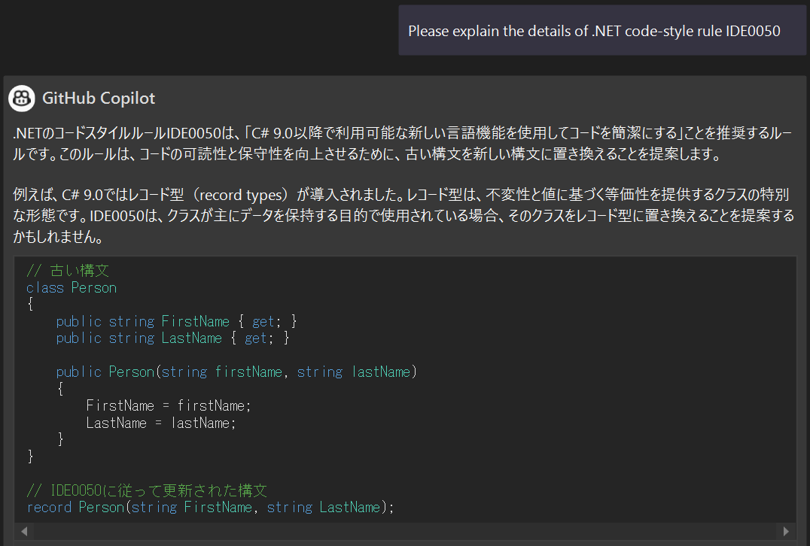

# 3. GitHub Copilot Chat

## GitHub Copilot Chat について

GitHub Copilot Chat は GitHub Copilot と同様に、 AI を活用したコード補完機能を提供します。  
加えて、コードに関する質問に答えたり、説明を提供したり、コードの変更を提案することで、コードの品質向上に活用することができます。

## GitHub Copilot Chat の使い方

GitHub Copilot Chat は、次の 2 つの方法で使用できます。

- チャットウインドウの使用
- エディター上でインラインでの使用

### チャットウインドウの使用

Visual Studio の上部メニューから 表示 > GitHub Copilot チャット と選択すると、チャットウインドウが表示されます。


チャットウインドウを開くと、 GitHub Copilot とのチャットを開始できます。  
会話の履歴が保存され、途中で質問に対する提案が提供されます。  
主に次のようなことができます。

- あらゆる言語でのコーディングやベストプラクティスに関する一般的な質問を行います
- 現在のファイルに関連するコード生成または修正を要求し、コードをファイルに直接挿入します

#### スラッシュコマンド

GitHub Copilot がより適切な回答を提供できるように、スラッシュコマンドを使用して質問のトピックを指定することができます。  
スラッシュコマンドを使用して特定のトピック名を付けることで、 GitHub Copilot がより適切な回答を返せるようになります。  
`/` を入力すると、スラッシュコマンド一覧が表示されます。


例えば下記のようなスラッシュコマンドがありますが、バージョンやエディタによってコマンドの有無が異なるのでご注意ください。

- **/explain** : 選択したコードのステップごとの説明を要求します
- **/fix** : 選択したコード内のバグの修正を提案します
- **/help** : GitHub Copilot に関する一般的なヘルプを取得します
- **/tests** : 選択したコードの単体テストを生成します

### エディター上でインラインでの使用

エディター上で `Alt + /` を押すと、エディター内に GitHub Copilot Chat のインラインコマンドウインドウが表示されます。  


インラインモードでは次のことが可能です。

- コードの説明をリクエストする: これにより、コードの機能とその動作を理解するのに役立ちます
- テスト コードを生成します。これにより、コードが期待どおりに動作していることを確認します
- コードの変更をリクエストする: 選択したコードに問題がある場合は、変更をリクエストできます
- 新しいコードの生成: 新しい機能、クラス、関数などのコードを生成できます

これらのリクエストは、選択されたコードまたはカーソルの位置に基づいて行われます。  
また、インラインチャットセッションを開始することによっても、これらのリクエストを行うことができます。

## コードの生成

### .NET アプリケーションの CRUD 操作を作成する

Web アプリケーションを作成する場合、 CRUD 操作をアプリケーションの機能として追加する必要がある場合があります。  
これには、Web フロントエンド、バックエンド処理の実装、およびプロパティ ファイルの構成が必要です。  
このような場合、 GitHub Copilot Chat に下記のようなコメントを入力すると、 CRUD アプリケーションの実装が提案されます。

```
Create a sample application that performs CRUD operations to manage people (name, id, e-mail, address) in ASP.NET Core. The data should be persisted to the DB, and the database operations should be implemented in Entity Framework Core. The front should be implemented in Razor Pages. Please show all implementation of classes and methods and application property configuration file.
```


## コードの説明

次に、 Visual Studio で現在開いている .NET のソースコードの内容を理解するために、ソースコードの説明を取得します。  
GitHub Copilot Chat には、ソースコード説明のために `/explain` スラッシュコマンドが用意されています。

例えば、 Program.cs ファイルを開いた状態で `/explain` コマンドを実行すると、下記のような説明が出力されます。


## コードの修正

GitHub Copilot はコードの修正にも利用できます。  
例えば、下記のようなコードを用意したとします。

```csharp
public static void showNumber(int? num) {
    int? result = null;
    if (num == null)
    {
        result = 0;
    }
    else
    {
        result = num;
    }
    Console.WriteLine(result);
}
```

この例では、 Null 合体演算子と暗黙的な型指定を使用するように変更させるため、上記コードを選択した状態で GitHub Copilot Chat に下記文章を入力します。

```
Modify your code to use the null-coalescing operators and to use var to define variables.
```

下記結果が出力されます。


コピーボタンを押下して提案されたコードをクリップボードにコピーすることができます。  
また、「プレビュー」ボタンを押下すると、 Visual Studio 上でコードの差分を確認することができ、その状態で「承認」ボタンを押すことで変更を適用することもできます。


## コーディング関連の質問への回答

### プログラミング言語の言語仕様に関する質問

C# を使ってプログラミングをしているときに、 C# の言語仕様について詳しく知りたいと思うことがあるかもしれません。  
そんなときに、 GitHub Copilot Chat にいろいろな質問をすることができます。

例えば、 C# 11 から C# 12 の間に追加された言語仕様について知りたい場合は、次のように質問できます。

```
What language specifications have been added from C# 11 to C# 12? In particular, please provide detailed information about the new writing style with sample code.
```

### ライブラリの移行に関する質問

アプリケーション開発では新規開発だけでなく、ソースコードのモダナイズや、他の古いフレームワークからの移行も必要になります。  
その際に、モダナイズ時の注意点や移行の具体的な手順などを質問することができます。

```
What should I keep in mind when migrating from a 6.x project to 8.x with ASP.NET Core?
```

### 特定のライブラリの使い方に関する質問

特定のライブラリを初めて使用する場合は、そのライブラリの使い方を知りたい場合があります。  
そのような場合は、ライブラリの使い方について質問することができます。

```
Please explain the implementation code for connecting to Azure Cosmos DB and Reading items using Azure SDK in an easy-to-understand manner with sample code.
```

### GitHub Copilot Chat の質問と回答に関する注意点

GitHub Copilot Chat を使用する際に注意すべき点は、すべての問い合わせに対して正しい回答が返ってくるわけではないということです。  
例えば、下記のように .NET のコードスタイル規則に関してルール ID での質問を行ったとします。

```
Please explain the details of .NET code-style rule IDE0050
```

場合によっては、下記のような回答が返されます。



これは、質問した [IDE0050: 匿名型をタプルに変換する](https://learn.microsoft.com/ja-jp/dotnet/fundamentals/code-analysis/style-rules/ide0050) とは全く関係のない、 [レコード - C# reference](https://learn.microsoft.com/ja-jp/dotnet/csharp/language-reference/builtin-types/record) の内容が返されているように見受けられます。

この例からもわかるように、 GitHub Copilot Chat が提案する内容は必ずしも正しいとは限りません。  
提案内容を理解し、必要に応じて修正を行ってください。

## ユニットテストの作成

アプリケーションを実装する際に、単体テストを作成する必要がある場合があります。  
このような場合、テストするクラスまたはメソッドを選択し、 GitHub Copilot Chat に単体テストの作成を依頼することができます。

例えば、 HomeController クラスの単体テストを作成する場合は、 HomeController.cs を開いた状態で `/tests` コマンドを使用することで、 GitHub Copilot Chat に単体テストの作成を依頼できます。  
`/tests` コマンドを実行すると、下記のように単体テストの実装計画とコードが生成されます。


## エラーの説明と修正

ソースコードのコンパイル時や実行時にエラーが発生することがあります。  
そのような場合に、 GitHub Copilot Chat にエラーの内容を尋ねることで、エラーについて説明してくれます。

例えば、下記のような構文でエラーに関する質問を行うことができます。

```
When running the application, the following exception was output. What does the following mean?  

### Exception
Copy & Paste the Stack Trace
###
```

さらに、下記のような質問を行うことで、発生した問題への対処方法の回答を得ることもできます。

```
How can I solve the above issues?
```

```
To solve the issue, please let me know how to implement *** with sample code.  
```

例えば、下記のようなメソッドを用意したとします。

```csharp
public static void parseNumber(string text)
{
    var result = int.Parse(text);
    Console.WriteLine(result);
}
```

特定の文字列を使用して上記メソッドを呼び出した際に、 `System.FormatException` が発生しました。  
実際に発生した例外について問い合わせ、対処方法を聞くと、下記のような回答が返ってきます。


上記のようにエラーを解決するために使用するだけでなく、例えば下記のような質問を行うことで潜在的なバグを見つけたり、コードの品質を向上させたりするために役立てることもできます。

```
Can you check this code for potential bugs or security issues?
```

```
Do you see any quality improvement to do on this code?
```

## まとめ

GitHub Copilot Chat は、 .NET アプリケーション開発における多目的ツールです。  
GitHub Copilot Chat を使用すると、生産性とコード品質を向上させることができます。ぜひお試しください。

---

- 前： [2. GitHub Copilot](./2-github-copilot.md)
- TOP： [README.md](./README.md)
