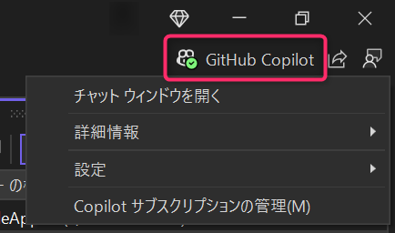

# hol-github-copilot-csharp（Visual Studio 版）

## ハンズオンの実施に必要なツール

- .NET 8 SDK
- Visual Studio 2022
- （Visual Studio バージョン 17.9 以前を使用している場合のみ）GitHub Copilot for Visual Studio
    - [Visual Studio で GitHub Copilot をインストールして管理する - Visual Studio (Windows) | Microsoft Learn](https://learn.microsoft.com/ja-jp/visualstudio/ide/visual-studio-github-copilot-install-and-states?view=vs-2022)
    - 17.10 以降は、明示的に除外しない限りは含まれます
- GitHub アカウント
    - GitHub Copilot が使用できること

### GitHub Copilot が有効化されているか確認する

Visual Studio の右上に GitHub Copilot のアイコンが表示され、緑のチェックマークがついていることを確認します。

もしチェックマークがついていなかったりアイコンが表示されない場合は、 GitHub アカウントの状態や GitHub Copilot for Visual Studio のインストール状態の確認を行ってください。  
Visual Studio 17.10 以降を使用している場合は、 [Copilot の状態を管理する](https://learn.microsoft.com/ja-jp/visualstudio/ide/visual-studio-github-copilot-install-and-states?view=vs-2022#manage-your-copilot-state) をご参考ください。

## ハンズオン手順

1. [サンプル .NET アプリケーションの作成](./1-create-sample-app.md)
2. [GitHub Copilot](./2-github-copilot.md)
3. [GitHub Copilot Chat](./3-github-copilot-chat.md)
