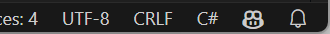
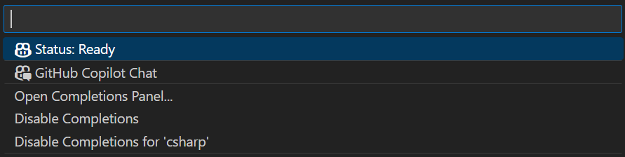

# hol-copilot-csharp

## ハンズオンの実施に必要なツール

- .NET 8 SDK
- Visual Studio Code
- Visual Studio Code 拡張機能
    - Copilot
    - Copilot Chat
    - C#
- GitHub アカウント
    - GitHub Copilot が使用できること

### GitHub Copilot が有効化されているか確認する

Visual Studio Code の右下に GitHub Copilot のアイコンが表示されているかを確認します。

アイコンをクリックし、 `Status: Ready` という表示がされることを確認します。

もし `Status: Ready` となっていなかったり表示されない場合は、 GitHub アカウントの状態や Visual Studio Code 拡張機能インストール状態の確認を行ってください。

## ハンズオン手順

1. [サンプル .NET アプリケーションの作成](./1-create-sample-app.md)
2. [GitHub Copilot](./2-github-copilot.md)
3. [GitHub Copilot Chat](./3-github-copilot-chat.md)
